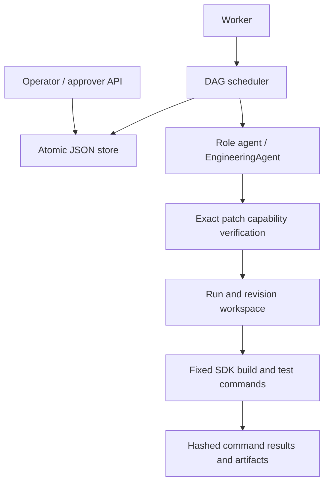

# Architecture and operating contract

The core library owns domain services, persistence, scheduler, agents and engineering execution. ASP.NET Core handles role-key authorization, routes and rate limits. `EngineeringDemo` uses the same services with interactive or explicitly simulated approvals. The URL service implements persistent creation, expiry, redirect and click-count behavior independently of workflow execution.

## DAG, scheduling and persistence

The default graph is requirements → design → parallel implementation/security → tests → release. Brownfield/ambiguous requirements are gated; engineering execution adds a gate before tests; release always requires approval. Graph validation requires unique IDs, known dependencies, no cycles and every node being an ancestor of release. Limits are 30 nodes, 1–5 attempts/node, four revisions and 1–16 concurrent nodes (default three).

Runs transition through Active, Paused, Stopping/Stopped, RollingBack/RolledBack and Completed. Nodes are Pending, Running, Succeeded, Failed or Compensated. The engine durably claims ready nodes before invoking agents, then overlaps independent work with `Task.WhenAll`. A slow batch member delays the next batch.

`JsonStore` holds an exclusive process-lifetime writer lock. Transactions clone state, mutate the clone, flush a temporary JSON file, rename it over the committed file, then update memory. Reads are detached copies. Invalid JSON or an invalid audit chain fails startup. Original unsealed prototype stores are not silently migrated: preserve them and use a fresh directory.

On restart, Running nodes are interrupted attempts; consumed budgets remain consumed. Nodes with remaining attempts return to Pending, while exhausted attempts trigger rollback. Remote calls are not exactly-once: a crash after provider acceptance may duplicate usage despite the stable idempotency header.

Transient network, 429, 5xx and timeout errors use bounded 1/2/4/8-second backoff. Permanent errors and failed validation trigger rollback. Default agent deadline is 60 seconds; engineering validation has a 300-second overall deadline and 90 seconds per child command. Cancellation kills child process trees and waits for cleanup before compensation. Safe-stop disables dispatch and discards late results, then drains to Stopped; it does not instantly stop provider computation. Unexpected persistence/compensation errors stop the application for manual inspection.

## Engineering capability and execution boundary

`PatchPolicy` supports one reviewed change: reserved aliases for new links while preserving existing stored records. `EngineeringPatch` includes a requirement ID, whole-baseline hash and two exact file edits with original hash, search anchor and replacement. Offline generation is deterministic; live generation must match that capability exactly. Unrecognized C#, paths, project changes, dependency changes or commands are rejected.

Only `src/Shortener.Core/LinkService.cs` and the regression insertion point in `tests/Shortener.Tests/Program.cs` can change. Alias inputs are bounded lowercase values; fixture aliases are protected. The baseline source/project files are trusted, not supplied by the model. Baseline loading rejects reparse points and skips build outputs. Workspace IDs are bounded and paths remain under the configured root.

Implementation creates an isolated candidate, patch JSON, unified diff, baseline hashes and archived originals. The execution gate binds the patch/dependency hashes. Validation then reconstructs the baseline and runs fixed commands:

1. Restore/build API and tests; run the existing suite including HTTP integration.
2. Add only the regression; require exit 1 and exactly the named regression failure.
3. Apply the implementation; rebuild and require the entire suite to return 0.

The report stores command arguments, exit codes, duration, bounded output and SHA-256, plus requirement/revision, baseline, patch and file hashes. It is also a durable workflow artifact. Generated claims never substitute for process exit results.

No shell is used. Child environment variables are cleared and rebuilt from required OS paths and workspace-local runtime/cache/temp directories; role/API secrets are not forwarded. Native processes still use the host user's OS authority. Exact template verification is the boundary, **not a general OS sandbox**. Hostile concurrent local filesystem modification, arbitrary changes to the trusted baseline and general code synthesis are outside scope. The optional Docker profile adds isolation but was not run here.

## Rollback and upstream changes

Rollback restores the two managed candidate files from archived originals after checking their manifest hashes. It retains the diff, validation results and original content for inspection, then compensates outputs in reverse dependency order. Restoration is idempotent. Missing/corrupt originals cause fail-stop/manual intervention. Old binaries are retained as historical outputs and are never promoted as a release. The live shortener database and external systems are not workflow effects and are not reverted.

Text-mode graph proposals may modify only unstarted work while preserving started nodes and gates. Engineering runs use requirement-change proposals to keep workspace and artifact revisions aligned.

A requirement proposal supplies context, structured engineering scope, reason and expected revision. Only a quiescent Active or Completed run may propose it. Dispatch pauses until an approver decides. Rejection preserves the old state. Acceptance archives the previous node/approval state, increments revision, clears outputs and approvals across the entire downstream closure of the changed root requirement, and queues superseded-workspace restoration before dispatch. Requirements, execution and release gates must be approved again. Each revision gets bounded attempts; the four-revision cap bounds re-execution. Prior artifacts and attempt/duration evidence remain in history.

## Traceability and integrity

Each `ArtifactRecord` links artifact ID, node, revision, requirement hash, adapter/model identity, dependency hashes, content hash, content, timestamp and success flag. Validation artifacts contain actual process results and modified-file hashes. Gate decisions bind the requirement/revision and predecessor hashes. Creation and change proposals preserve the full supplied scope.

Audit records contain sequence, timestamp, role actor, action, details, previous hash and SHA-256. Startup and `/api/audit-integrity` verify the chain. This detects corruption and edits that are not rehashed. It is not a signature or write-once log: a disk administrator can rewrite/recompute the entire chain or truncate the tail. Independent retention/anchoring of the head is needed to detect that. Role keys identify roles, not individual people. Hashes do not prove authorship, model quality or software correctness.

## Reliability metrics

`/api/reliability` provides values with sample counts; `/metrics` exposes equivalent Prometheus gauges. Undefined values are JSON null/Prometheus NaN.

| Metric | Definition |
|---|---|
| Success rate | Currently Completed runs / terminal runs (Completed, Stopped, RolledBack); active/incomplete states excluded. |
| Retry frequency | Distinct runs with a retry-scheduled event / created runs. |
| Rollback frequency | Distinct runs with a rolled-back event / created runs. |
| Mean recovery time | Detection of a persisted Running node at startup to its eventual success, including intervening retries. |
| Mean end-to-end latency | Successful revision completion minus create/accepted-requirement-change time, including queueing, gates, execution and retries. |

Recovery is a restart-to-node-recovery proxy, **not full incident MTTR**: pre-restart outage time is unknown and unresolved recoveries are excluded. Run-rate denominators count a multi-revision run once; completion latency counts each successful revision. Attempt totals derive from audit; durations include archived revisions. The bundled measurement uses simulated approvals and injected faults and is not a production reliability claim. Environmental stalls are included in wall-clock latency.

## Structured security gate and findings-driven planning

Security output is `SecurityReport`: current requirement hash, pass/fail verdict, up to four findings (ID, severity, open/resolved status, evidence and concrete remediation), and an optional supported engineering-scope recommendation. The scheduler parses this schema independently of the agent. A declared pass with an open high/critical finding still blocks; malformed/stale output fails closed. The graph validator requires security review before tests.

A blocking report is retained as unsuccessful quality evidence. Its processing node may be Succeeded, but the run is Paused and cannot dispatch tests or accept release approval. `Quality.Propose` derives remediation task content and task count from the findings, adds dependencies before implementation/security, and stores a proposal bound to the source artifact/hash. It does not approve its own plan. Accepting the proposal starts a fresh revision with invalidated outputs and approvals; security must rerun. Rejecting it rolls back rather than waiving the blocker. Repeated blockers consume the same four-revision cap.

The initial scaffold and allowed execution capability remain predefined. This is findings-driven graph expansion with model-supplied task content, not arbitrary model-generated planning or open-ended code synthesis. Offline finding detection is a labeled fixture. Structured reports enforce declared findings but cannot guarantee that a model discovers every vulnerability or truthfully marks issues resolved.

## Concrete scope, validation and fallback

Each new run has a `ScopeContract` with acceptance criteria for URL validation, redirect/count persistence, expiry, aliases and authorization. Ambiguous contracts start with unanswered creation/retention/alias decisions. Requirements approval is blocked until an operator records the supported concrete answers. Other answers are rejected as outside the current capability rather than silently treated as implemented. Evidence records unanswered scope, answers, reviewed requirements and acceptance-to-test mappings.

Greenfield/ambiguous validation reconstructs and builds the included from-scratch implementation and executes the test harness with HTTP integration. This is real validation of the deliverable, not a claim that those scenarios generated fresh source independently.

Fallback is a separate, optional execution route. Exhausted primary transient retries pause the workflow with alternate agent/model identity and a reason. An approver may authorize one fallback attempt per node/revision, or reject and roll back. Approval stores an immutable `FallbackIdentity` copied from the proposal as `WorkNode.ApprovedFallback`; it is retained through persistence and ordinary plan copies. Primary budgets are retained; fallback failures do not loop.

Before claiming work, the scheduler compares both stored agent and model strings to the configured fallback with ordinal equality. Changed identity, absent configuration, or a legacy `UseFallback=true` without the identity fails closed before incrementing an attempt or calling either agent. It emits `fallback-identity-mismatch` with approved/configured identities and transitions to rollback. The identity is also copied into the execution request and rechecked immediately before invoking the adapter. An unchanged identity remains authorized after restart; approving an old proposal after a configuration change still approves its original identity, not the new configuration. To use a different model after rejection, create a new run/proposal and approve that choice.

Output provenance names the actual executor and is checked by the same security gate. API live mode accepts a distinct fallback model; it never silently switches to offline output. Identity binding is to the configured adapter/model names, not a cryptographic fingerprint of remote model weights; use a pinned provider model identifier where available if version stability matters.

Reliability now also reports observed failure-to-node-recovery duration: the first detected failed attempt to eventual successful execution, including backoff and approval waits. This complements restart-to-recovery timing. `MeanObservedRecoveryMs` includes only recovered samples; it is not whole-service incident MTTR, and undetected outage time or unresolved incidents are not represented. Fallback execution counts and sample counts are explicit.

## Remaining limitations

- Single process, whole-file JSON writes, no HA/replication, indexing, retention or pagination; no disk-full/power-loss testing or directory fsync.
- Constrained reserved-alias capability only; no general coding agent sandbox, deployment, candidate promotion or live legacy migration.
- No independent audit anchor, OIDC, per-user approval identity, tenant isolation or secret rotation. Add TLS before shared deployment.
- No destination malware checks, deletion/abuse reporting or domain policy. HTTP(S) redirects may target private hosts; destinations are not fetched.
- No retry jitter, Retry-After, circuit breaker, global monetary budget or token/billing telemetry.
- Live provider calls, Docker, Linux CI, load testing and hostile local race testing were not performed. Health indicates process availability only.

Reference contracts: [Microsoft .NET containers](https://learn.microsoft.com/en-us/dotnet/core/docker/build-container), [OpenAI Responses API](https://developers.openai.com/api/reference/cli/resources/responses/methods/create).
